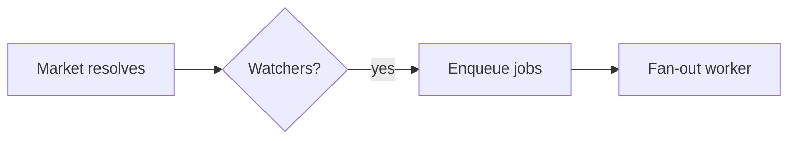

<!-- Adapted from affaan-m/ECC (MIT), commit d3b8a3e. Merged for Neva. -->

# Plan Canvas

Review loop for plans and visual artifacts: you write the artifact, the human
reviews it in the browser: annotating the exact element they mean, chatting,
and delivering an **Approve plan / Request changes** verdict: while you block
on a single CLI call that returns their feedback as JSON.

Inspired by [lavish-axi](https://github.com/kunchenguid/lavish-axi); built
around the `/plan` confirmation gate, with zero npm dependencies.
**requires: node** (the CLI and server are plain Node scripts shipped in `scripts/`).

## When to Use

- You just wrote a plan artifact (`.claude/plans/*.plan.md` from `/plan`) and
  need the CONFIRM/approve decision: the canvas verdict replaces a typed
  "yes/proceed".
- The user should *point at* what to change: reviewing designs, comparisons,
  reports, or any local `.md` / `.html` artifact.
- The user asks for `/plan-canvas`, a visual review, or "open it in the browser".

Do NOT use for: code review of diffs (`/code-review`), running web apps, or
remote URLs. The canvas serves local artifact files only.

## How It Works

Invoke the CLI through the script shipped with this skill. Define it once per
shell call:

```bash
PC="node ${CLAUDE_PLUGIN_ROOT}/skills/plan-canvas/scripts/plan-canvas.js"
```

Run it from the project you are reviewing in; it works from any working
directory. It manages a detached loopback server (`127.0.0.1:4517`) shared by
all sessions, keyed by artifact path: no session ids to track.

The workflow is a plain CLI-plus-JSON loop, so it is model- and harness-agnostic:
any agent that can run a shell command and read stdout drives it the same way.
Trigger it with `/plan-canvas` or run the `$PC` commands directly.

```bash
# 1. Open the artifact in the user's browser (returns immediately)
$PC open .claude/plans/feature.plan.md

# 2. Block until the human responds. Leave running; re-run if interrupted:
#    queued feedback is never lost.
$PC await .claude/plans/feature.plan.md
```

### Stay listening, or the human talks to an empty chair

Feedback only reaches you while an `await` is actually parked on the session.
If your turn ends with nothing listening, the message sits in the queue and,
from the human's side of the glass, sending appears to do nothing at all.

So **run `await` as a background task** when your harness supports one (in
Claude Code, a Bash call with `run_in_background: true`). It exits the moment
feedback arrives and the harness hands you the JSON, which keeps the loop alive
across turns instead of dying with the foreground call. A foreground `await`
works too, but only until the harness time-limits it.

Two backstops exist, and neither is an excuse to skip the above:

- `$PC pending` lists feedback queued with no listener. Check it
  whenever you are unsure whether you missed something.
- The `plan_canvas_pending` Stop hook (neva-core hook runtime,
  `hooks/neva_hooks/plan_canvas.py`, every profile) blocks your turn from ending
  while canvas feedback is undelivered, and hands you the messages. If you are
  reading feedback from that hook, you stopped listening too early.
  It reads `sessions.json` and the server port from `server.json` in the canvas
  state dir, considers open sessions with queued feedback whose artifact lives
  under the working directory (`NEVA_PLAN_CANVAS_STOP_SCOPE=all` widens it),
  drains each through the server's own `GET /api/await?key=<key>&timeoutMs=0`
  (1 s timeout, so the server stays the owner of its state and every item is
  delivered once), and blocks with up to 20 items as the reason. Any error, a
  missing state dir or an unreachable server allows the stop.

`await` prints JSON when the human acts:

```json
{
  "status": "feedback",
  "items": [
    { "kind": "annotation", "text": "Split this into two phases",
      "anchor": { "selector": "h2:nth-of-type(3)", "tag": "h2", "snippet": "Phase 2: Migration" } },
    { "kind": "verdict", "verdict": "request-changes" }
  ]
}
```

- `kind: "chat"`: freeform message; answer in the canvas, not the terminal.
- `kind: "annotation"`: feedback anchored to an element (`anchor.selector`,
  `anchor.snippet` show what they pointed at; `anchor.textRange.text` when
  they highlighted a passage).
- `kind: "verdict"`: `approve` means the plan is CONFIRMED: stop polling,
  end the session, and start implementing. `request-changes` means revise the
  artifact (the canvas live-reloads it) and keep the loop going.

**3. Always respond in the canvas**, then keep listening. One command does both:

```bash
$PC await <file> --reply "Split Phase 2 as requested. Take a look."
```

Every human message gets a reply in the canvas, even a one-liner like
"On it, rewriting the risk table now." Silence in the chat panel is
indistinguishable from a broken canvas, which is exactly the failure this loop
exists to prevent. Answer there, not only in the terminal.

While you work, keep the chat honest with the activity indicator:

```bash
# animated "agent is thinking..." bubble; refresh it during long work
$PC typing <file> --state thinking
# switch to "agent is typing..." just before a reply lands
$PC typing <file> --state typing
```

`await` sets `thinking` for you the moment it hands you a batch, and `--reply`
clears it. Both states self-expire, so a crashed agent decays to an honest
"queued" instead of leaving the human watching dots forever. Refresh `thinking`
if a revision takes more than a minute.

**4. End** when review concludes: `$PC end <file>`.

## Diagrams (Mermaid)

When part of the plan is a flow, architecture, sequence, state machine, ER
model, or dependency graph, author it as a fenced ` ```mermaid ` block instead
of ASCII art or a wall of prose: the canvas renders it as a themed diagram the
human can point at. Reach for it when a picture reads faster than a paragraph;
skip it for simple lists or tables.

````markdown

````

Diagrams render in the canvas dark theme with the accent palette. Mermaid loads in
the browser from a pinned CDN; if that is unavailable (offline), the block
degrades to showing its source, so the review is never blocked. Point a local
mirror at `NEVA_PLAN_CANVAS_MERMAID_URL` for air-gapped use.

## Rules

- Markdown artifacts render in the canvas plan template (including Mermaid blocks);
  `.html` artifacts render as-is with the annotation layer injected. For HTML
  authoring guidance use the `frontend-design-direction` and `artifact-design`
  skills.
- Edit the artifact file to revise: the canvas live-reloads on save. Never
  re-run `open` to refresh.
- `{"status": "ended", "endedBy": "user"}` (or `sessionEnded: true` on a
  feedback batch) means the user closed the review: stop polling, deliver
  remaining updates in chat, and do not reopen. A plain `open` on that
  session is refused; pass `--reopen` only when the user asks to resume.
- Sibling assets (images, CSS) must sit next to the artifact and be
  referenced by relative path.
- The server is loopback-only and exits after 30 idle minutes
  (`NEVA_PLAN_CANVAS_IDLE_MS`); `stop` shuts it down explicitly. State lives
  in `<NEVA_STATE_DIR>/plan-canvas/`, default `~/.local/state/neva/plan-canvas/`
  (override: `NEVA_PLAN_CANVAS_STATE_DIR`). The CLI and the Stop hook resolve it
  the same way. Port: `NEVA_PLAN_CANVAS_PORT`.

## Examples

**Plan approval flow**: `/plan` writes
`.claude/plans/notifications.plan.md` and must WAIT for confirmation:

```bash
$PC open .claude/plans/notifications.plan.md
$PC await .claude/plans/notifications.plan.md
# → {"status":"feedback","items":[{"kind":"verdict","verdict":"approve"}]}
$PC end .claude/plans/notifications.plan.md
# plan is confirmed - begin implementation
```

**Revision loop**: feedback arrives, you edit the file, reply, keep listening:

```bash
# await returned annotations → edit the .plan.md (canvas live-reloads)
$PC await <file> --reply "Reworked the risk table."
# → blocks again until the next response
```

## Anti-Patterns

- Polling with `--timeout-ms` in a loop. It exists for tests. Leave the plain
  `await` running instead.
- Ending your turn with no `await` listening while the review is still open.
  That is the one failure the human experiences as "I sent a message and
  nothing happened".
- Reading the feedback but answering only in the terminal. The human is looking
  at the canvas.
- Reopening after a user-initiated end "just to show" something.
- Pasting the whole plan into chat *and* opening a canvas: pick the canvas
  and keep the terminal summary to one line.
- Parsing the canvas chat from state files: everything you need arrives via
  `await`.

Origin: ECC `docs/design/plan-canvas.md` (upstream design notes, not shipped).
